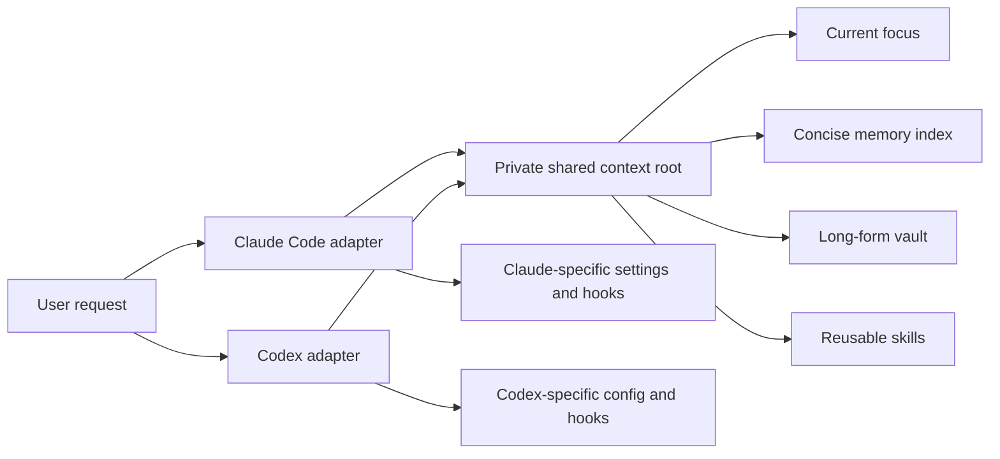

# Personal AI Operating Layer

A sanitized reference architecture for giving multiple AI coding clients durable, shared context without publishing the private system that inspired it.

This repository shows the relationships between instruction files, memory, long-form notes, reusable workflows, and client-specific automation. Every included file uses fictional data or placeholders. It does **not** contain a live `CLAUDE.md`, `AGENTS.md`, memory store, vault, credential, hook configuration, or personal absolute path.

## The core idea

Treat each AI client as a stateless reader and writer around one private, filesystem-backed context layer:

The shared files are the source of truth. `CLAUDE.md` and `AGENTS.md` are thin adapters: they tell each client where the shared context lives, when to retrieve it, and how to save durable knowledge. Client-specific settings, permissions, and hooks stay client-specific.

## What this reference includes

- [Architecture](docs/architecture.md): component boundaries, pointer map, retrieval flow, and persistence model
- [Setup guide](docs/setup.md): a safe manual rollout for Claude Code, Codex, or both
- [Bootstrap prompt](reference/BOOTSTRAP_PROMPT.md): instructions you can hand to an AI client to adapt the blueprint without overwriting existing configuration
- [Reference tree](reference/README.md): dummy adapters, memory, vault notes, and a review-gated workflow skill

## Design principles

1. **One brain, many clients.** Durable knowledge lives in shared files, not in a model-specific conversation history.
2. **Retrieve on demand.** Start with the request and repository guidance. Load personal context only when the task needs it.
3. **Keep the hot index small.** A concise `MEMORY.md` points to focused topic files; long-form material belongs in the vault.
4. **Separate knowledge from procedure.** Memory records facts and decisions. Skills describe repeatable workflows.
5. **Separate shared state from client mechanics.** Hooks, permissions, plugins, and tool configuration do not automatically port between clients.
6. **Review governance changes.** Do not silently rewrite global instructions, shared skills, or memory conventions.
7. **Verify consumption, not existence.** A file on disk is not proof that a client loaded or followed it.

## What changed from the original project description

The first version documented a Claude-only memory and skill system at a high level. The current reference reflects a more mature design:

- Claude Code and Codex can share the same private filesystem stores.
- Retrieval is narrow and task-driven rather than a ritual bulk-load at every session.
- Long-form notes and concise operational memory have separate jobs.
- Semantic or hybrid recall is optional infrastructure, not a required daemon.
- Historical conversation archives, if retained, are read-only sources rather than the live memory system.
- No background memory service is required for the architecture to work.

## Security boundary

Keep the real context root private. Before publishing any derivative:

- replace usernames, home directories, project names, IDs, URLs, and dates;
- exclude `.env` files, credentials, browser profiles, transcripts, databases, and local agent state;
- publish templates rather than copies of live global instruction files;
- inspect the complete Git diff before every public push.

The repository `.gitignore` blocks common local state and secret-file patterns, but it is only a backstop.

## Product-specific loading behavior

- Claude Code supports user and project `CLAUDE.md` files, project rules, and per-project auto memory. See the official [Claude Code memory documentation](https://code.claude.com/docs/en/memory).
- Codex reads global guidance from `AGENTS.md` in `CODEX_HOME` (normally `~/.codex`) and layers repository guidance from the project root toward the working directory. See the official [Codex `AGENTS.md` documentation](https://learn.chatgpt.com/docs/agent-configuration/agents-md).

Those products may change independently. Re-check their official documentation before turning this reference into automation.

Maintained by [Pierce Hollar](https://github.com/piercehollar1-tech).
