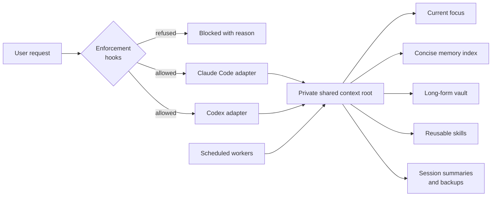

# Personal AI Operating Layer

A sanitized reference architecture for giving multiple AI coding clients durable, shared context — and for putting controls around them that hold when the model's attention does not.

This repository shows the relationships between instruction files, memory, long-form notes, reusable workflows, scheduled work, and the enforcement layer that governs all of it. Every included file uses fictional data or placeholders. It does **not** contain a live `CLAUDE.md`, `AGENTS.md`, memory store, vault, credential, hook configuration, or personal absolute path.

## The core idea

Treat each AI client as a stateless reader and writer around one private, filesystem-backed context layer, with a control layer between the client and anything expensive:

```mermaid
flowchart LR
    U[User request] --> G{Enforcement<br/>hooks}
    G -->|refused| X[Blocked with reason]
    G -->|allowed| C[Claude Code adapter]
    G -->|allowed| K[Codex adapter]
    C --> S[Private shared context root]
    K --> S
    S --> T[Current focus]
    S --> M[Concise memory index]
    S --> V[Long-form vault]
    S --> W[Reusable skills]
    J[Scheduled workers] --> S
    S --> R[Session summaries<br/>and backups]
```

The shared files are the source of truth. `CLAUDE.md` and `AGENTS.md` are thin adapters: they tell each client where the shared context lives, when to retrieve it, and how to save durable knowledge. Client-specific settings, permissions, and hooks stay client-specific.

## What this reference includes

- [Architecture](docs/architecture.md) — component boundaries, pointer map, retrieval flow, persistence model
- [Enforcement](docs/enforcement.md) — turning rules that matter into controls that run whether or not anyone remembered them
- [Automation and continuity](docs/automation.md) — scheduled work, session persistence, and the loop that makes the layer improve instead of accumulate
- [Setup guide](docs/setup.md) — a safe, staged rollout
- [Bootstrap prompt](reference/BOOTSTRAP_PROMPT.md) — instructions you can hand to an AI client to adapt the blueprint without overwriting existing configuration
- [Reference tree](reference/README.md) — dummy adapters, memory, vault notes, a review-gated workflow skill, and example hooks

## Design principles

1. **One brain, many clients.** Durable knowledge lives in shared files, not in a model-specific conversation history.
2. **Retrieve on demand.** Start with the request and repository guidance. Load personal context only when the task needs it.
3. **Keep the hot index small.** A concise `MEMORY.md` points to focused topic files; long-form material belongs in the vault.
4. **Separate knowledge from procedure.** Memory records facts and decisions. Skills describe repeatable workflows.
5. **Separate shared state from client mechanics.** Hooks, permissions, plugins, and tool configuration do not automatically port between clients.
6. **Review governance changes.** Do not silently rewrite global instructions, shared skills, or memory conventions.
7. **Verify consumption, not existence.** A file on disk is not proof that a client loaded or followed it.
8. **Instructions for preferences, controls for consequences.** A rule whose violation is expensive or irreversible belongs in a hook, not a document.
9. **Fail closed.** When a control cannot evaluate its condition, it blocks.
10. **Prove a control by breaking it.** Green is not evidence; a hook with an inverted condition passes every test where nothing is wrong.

## What changed in this revision

The first version documented a Claude-only memory and skill system at a high level. The second added multi-client sharing and narrowed retrieval. This one adds the parts that were doing the most work in practice and were entirely absent from the write-up:

- **An enforcement layer.** The single largest omission. Rules that matter are hooks, not paragraphs — and the document now covers the lifecycle surface, fail-closed behaviour, mutation testing, and the denylist-versus-allowlist trap that defeats the obvious implementation of a publication gate.
- **Scheduled autonomous work,** with the failure modes that actually bite: a sleeping machine, catch-up runs, marker-based idempotency, and why a scheduler's own run counter is not a liveness signal.
- **Session continuity** — automatic summarization, drain queues for decisions, detached end-of-session hooks, and a ceiling on every append target decided at creation rather than after it hurts.
- **A self-improvement loop** that routes each new fact to exactly one home at write time, so knowledge improves rather than piling into whichever file was open.
- Verification is no longer described as a habit. It is a control.

## Security boundary

Keep the real context root private. Before publishing any derivative:

- replace usernames, home directories, project names, IDs, URLs, and dates;
- exclude `.env` files, credentials, browser profiles, transcripts, databases, and local agent state;
- publish templates rather than copies of live global instruction files;
- **scan the complete tree with nothing excluded**, and scan untracked files as well as tracked ones — an exclusion added to quieten noise is where unreviewed content collects, and content staged in the same command as the publish is not yet tracked when a pre-command hook runs;
- inspect the complete Git diff before every public push.

The repository `.gitignore` blocks common local state and secret-file patterns, but it is only a backstop. So is a scan you run by hand — see [enforcement](docs/enforcement.md) for making it a control.

## Product-specific loading behavior

- Claude Code supports user and project `CLAUDE.md` files, project rules, and per-project auto memory. See the official [Claude Code memory documentation](https://code.claude.com/docs/en/memory).
- Codex reads global guidance from `AGENTS.md` in `CODEX_HOME` (normally `~/.codex`) and layers repository guidance from the project root toward the working directory. See the official [Codex `AGENTS.md` documentation](https://learn.chatgpt.com/docs/agent-configuration/agents-md).

Those products may change independently. Re-check their official documentation before turning this reference into automation.

## License

MIT.
