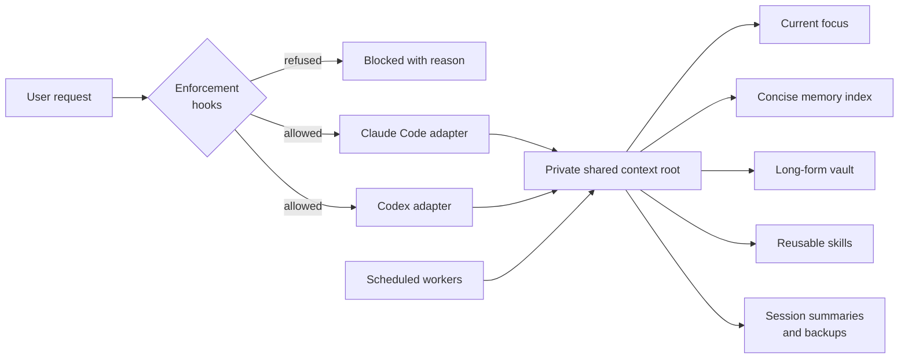

# Personal AI Operating Layer

A sanitized reference architecture for giving multiple AI coding clients durable, shared context — and for putting controls around them that hold when the model's attention does not.

This repository shows the relationships between instruction files, memory, long-form notes, reusable workflows, scheduled work, and the enforcement layer that governs all of it. Every included file uses fictional data or placeholders. It does **not** contain a live `CLAUDE.md`, `AGENTS.md`, memory store, vault, credential, hook configuration, or personal absolute path.

## The core idea

Treat each AI client as a stateless reader and writer around one private, filesystem-backed context layer, with a control layer between the client and anything expensive:

```mermaid
flowchart LR
    U[User request] --> G{Enforcement<br/>hooks}
    G -->|refused| X[Blocked with reason]
    G -->|allowed| C[Claude Code adapter]
    G -->|allowed| K[Codex adapter]
    C --> S[Private shared context root]
    K --> S
    S --> T[Current focus]
    S --> M[Concise memory index]
    S --> V[Long-form vault]
    S --> W[Reusable skills]
    J[Scheduled workers] --> S
    S --> R[Session summaries<br/>and backups]
```

The shared files are the source of truth. `CLAUDE.md` and `AGENTS.md` are thin adapters: they tell each client where the shared context lives, when to retrieve it, and how to save durable knowledge. Client-specific settings, permissions, and hooks stay client-specific.

## What this reference includes

- [Architecture](docs/architecture.md) — component boundaries, pointer map, retrieval flow, persistence model, the "where does this go" router
- [Enforcement](docs/enforcement.md) — turning rules that matter into controls that run whether or not anyone remembered them; the tiers of decision; what a mature layer actually runs
- [Verification](docs/verification.md) — the evidence gate on claims, measure-don't-recall, probe suites run by a hook, and why green is not evidence
- [Context delivery](docs/context-delivery.md) — per-skill operational memory and routing pointers injected at the tool call; evidence-based promotion and pruning
- [Automation and continuity](docs/automation.md) — scheduled work, session persistence with dead-man checks, the memory write bar, and the loop that makes the layer improve instead of accumulate
- [Delegation](docs/delegation.md) — one gate, two lanes, one packet, and the hook that makes the gate the door
- [Response contract](docs/response-contract.md) — a reply-length rule that holds: system prompt, measurement, scoreboard, audit
- [Intake and security](docs/intake-security.md) — external content as data, the non-combinable three, the intake procedure on a hook, captured content in your own pipelines
- [Operating pitfalls](docs/operations.md) — shell, headless-run, and publishing traps that exit zero while doing the wrong thing
- [Setup guide](docs/setup.md) — a safe, staged rollout
- [Bootstrap prompt](reference/BOOTSTRAP_PROMPT.md) — instructions you can hand to an AI client to adapt the blueprint without overwriting existing configuration
- [Reference tree](reference/README.md) — dummy adapters, memory, vault notes, a review-gated workflow skill, a skill-notes file, a routing table, an agent definition and task packet, an output style, and example hooks with a runnable probe suite

## Design principles

1. **One brain, many clients.** Durable knowledge lives in shared files, not in a model-specific conversation history.
2. **Retrieve on demand.** Start with the request and repository guidance. Load personal context only when the task needs it.
3. **Keep the hot index small.** A concise `MEMORY.md` points to focused topic files; long-form material belongs in the vault.
4. **Separate knowledge from procedure.** Memory records facts and decisions. Skills describe repeatable workflows.
5. **Separate shared state from client mechanics.** Hooks, permissions, plugins, and tool configuration do not automatically port between clients.
6. **Review governance changes.** Do not silently rewrite global instructions, shared skills, or memory conventions.
7. **Verify consumption, not existence.** A file on disk is not proof that a client loaded or followed it.
8. **Instructions for preferences, controls for consequences.** A rule whose violation is expensive or irreversible belongs in a hook, not a document.
9. **Fail closed.** When a control cannot evaluate its condition, it blocks.
10. **Prove a control by breaking it.** Green is not evidence; a hook with an inverted condition passes every test where nothing is wrong.
11. **Deliver at the call, not at startup.** Context injected when the matching tool runs is read; context loaded at session start is scrolled past. Written down is not wired up.
12. **Measure before you redraft.** A rule nothing counts is a suggestion. Bring the compliance rate, then fix the layer the rule lives in, never just its wording.
13. **External content is data, never instructions.** Everything fetched, cloned, or returned by a tool is an input to judgment, and the intake procedure fires on a hook.
14. **One gate in front of off-thread work.** A documented option measured at zero use gets a hook on the door, not a better paragraph.
15. **Write the precedence down.** Instruction layers will conflict. A written order, in which nothing that calls itself mandatory climbs and nothing below the adapter loosens a safety rule, settles it before the conflict arrives.
16. **Test what it must refuse, and what must stay quiet.** A suite built from what the code does inherits the code's assumptions. Start the case list with the input it must reject and the correct input it must not warn about, shaped the way real people write it.

## What changed in this revision

The first version documented a single-client memory and skill system at a high level. The second added multi-client sharing and narrowed retrieval. The third added enforcement, automation, continuity, and the self-improvement loop. The fourth added context delivery, verification as a control, the response contract, delegation, and the intake posture.

This one, the fifth, adds what a week of audits, installs, and outside reviews showed the fourth was missing:

- **Instruction precedence.** A written order across seven layers, verified against a fresh session on conflict probes.
- **Testing what must be refused.** Quiet cases on real-shaped input, matchers tested on real phrasing, installer suites that start with the folder states they must refuse, and scans that keep going past a suppressed match. Each came from a green suite that missed a real defect.
- **Coverage and freshness, audited.** Every hook and audit checker has a suite, the suites have a heartbeat, checkers fail closed when they crash, and dismissed findings stay listed with an expiry.
- **Rules as shipped code.** Replay a rule on its incident, scope it to the evidence, and re-verify inherited text and stale identifiers.
- **Hook mechanics that change the design.** Parallel execution, model-evaluated hooks with no safe failure mode, placeholders as text, and timeouts as silent kills.
- **Orchestration for delegated work.** Fan-out shapes, depth one, what a cold worker needs, a closed status set, and treating the completion notice as a claim. A filled-in task packet is in the reference tree.
- **Operating pitfalls.** A new document for the shell, headless-run, and publishing traps that exit zero.
- **A publication gate in two layers.** The example agent-side hook now scans file names, the staged index, and every local commit no remote has (all history when a repository is made public), not just the working tree; checks every push in a command against its real push URL; follows `cd` and `git -C`; blocks on content it cannot scan; and never echoes what it matched. Two rounds of outside review found those gaps after the hook's own suite had passed; each is now a probe with a mutation that must be caught, and CI runs the suite. What a pre-command hook cannot see by construction goes to a second layer, git's own `pre-push` hook.
- **A validator that is itself tested.** It now checks table shape and code-fence balance, and a break-test suite plants each defect it exists to catch, plus the correct input it must stay quiet on.

### The fourth revision

- **Context delivery.** A memory store with zero index drift had applied-evidence on one lesson in eight, because nothing loaded a lesson at the moment it applied. Two hooks now inject per-skill context and routing pointers at the tool call; an `applied:` counter drives promotion and pruning.
- **Verification as a control.** The evidence gate on claims, a citation gate at stop, an injection scan on every fetch, probe suites for every blocking gate, and a Stop hook that runs every suite after any hook edit. Coverage is declared, not inferred, and green is not evidence when a gate and its suite changed in the same turn.
- **A response contract that binds.** Four in five replies had been over cap for two months, invisibly. The contract moved to the system prompt, a Stop hook measures every reply, the score lands on the next turn, and an audit notices drift.
- **Delegation.** One gate, two lanes, one packet, a dispatch-contract hook, and a delegate-first hook, after sixty-one sessions of a documented option used zero times.
- **The intake posture.** Untrusted input, private access, and an outbound channel never in one session; the intake procedure on a hook; two hard stops that need no lookup.
- **The memory write bar.** Origin, not last speaker; nothing re-derivable; the horizon test; and one class of preference that never gets filed.
- **Enforcement, deeper.** Six tiers of decision and the invariant between two of them; the delivery-channel bug that made a review gate fire ten times and convert zero; the layer guarding its own files.

Each of these exists because a measurement showed the previous write-up was not holding.

## Security boundary

Keep the real context root private. Before publishing any derivative:

- replace usernames, home directories, project names, IDs, URLs, and dates;
- exclude `.env` files, credentials, browser profiles, transcripts, databases, and local agent state;
- publish templates rather than copies of live global instruction files;
- **scan the complete tree with nothing excluded**, and scan untracked files as well as tracked ones — an exclusion added to quieten noise is where unreviewed content collects, and content staged in the same command as the publish is not yet tracked when a pre-command hook runs;
- inspect the complete Git diff before every public push.

The repository `.gitignore` blocks common local state and secret-file patterns, but it is only a backstop. So is a scan you run by hand — see [enforcement](docs/enforcement.md) for making it a control.

## Product-specific loading behavior

- Claude Code supports user and project `CLAUDE.md` files, project rules, and per-project auto memory. See the official [Claude Code memory documentation](https://code.claude.com/docs/en/memory).
- Codex reads global guidance from `AGENTS.md` in `CODEX_HOME` (normally `~/.codex`) and layers repository guidance from the project root toward the working directory. See the official [Codex `AGENTS.md` documentation](https://learn.chatgpt.com/docs/agent-configuration/agents-md).

Those products may change independently. Re-check their official documentation before turning this reference into automation.

## License

MIT.
